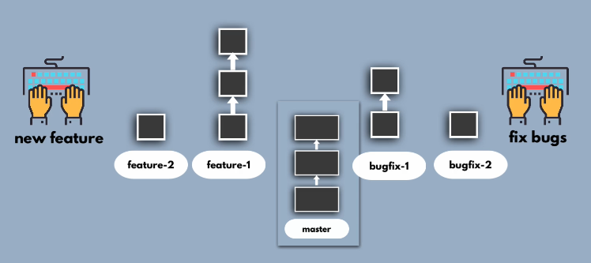

# Concept of branches

## Basic commands

***Display all branches***
```Git
git branch -a
```

***Create a branch***
```Git
git branch nameOfBranch
```

***Switch to branch***
```Git
git switch nameOfBranch
```

***Create & Switch a branch***
```Git
git switch -b nameOfBranch
```

***Delete a branch***
```Git
git branch -d nameOfBranch
```
> Best practice: delete all branches & bugfix when they are merged

***Pull a branch from remote repo***
```Git
git pull nameOfBranch
```

***Push a branch to remote repo***
```Git
git push nameOfBranch
```
# Best practice for general development
> Create a dev branch \
> Create a branch for each feature & bugfix \
> With the following syntax: feature/auth - bugfix/auth 
> Merge features & bugfixes to dev branch & then merge dev branch to main/master branch


# Best practice for DevOps CI/CD

> Only 1 branch (main/master) for continuous integration/delivery  
> Pipeline is triggered whenever feature/bugfix code is merged into main branch 


